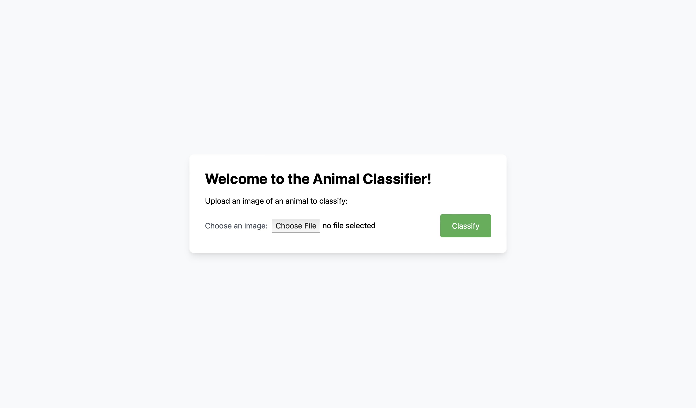
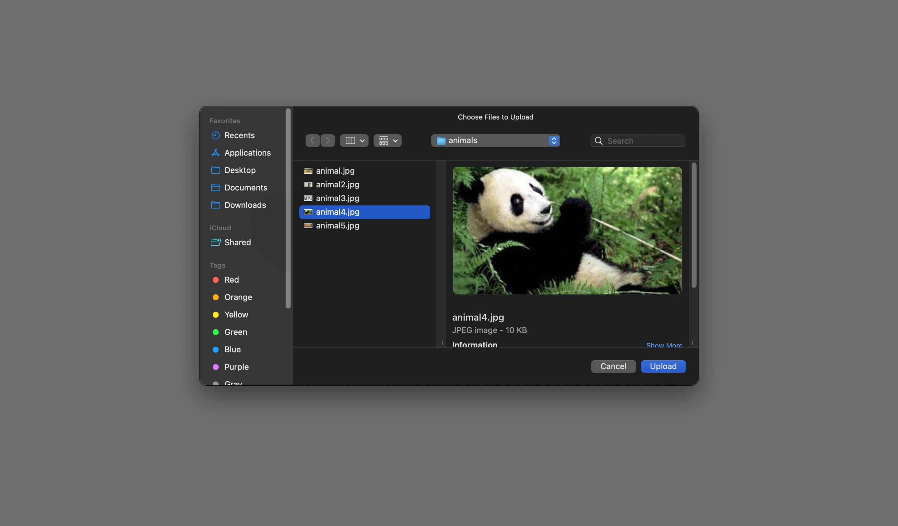
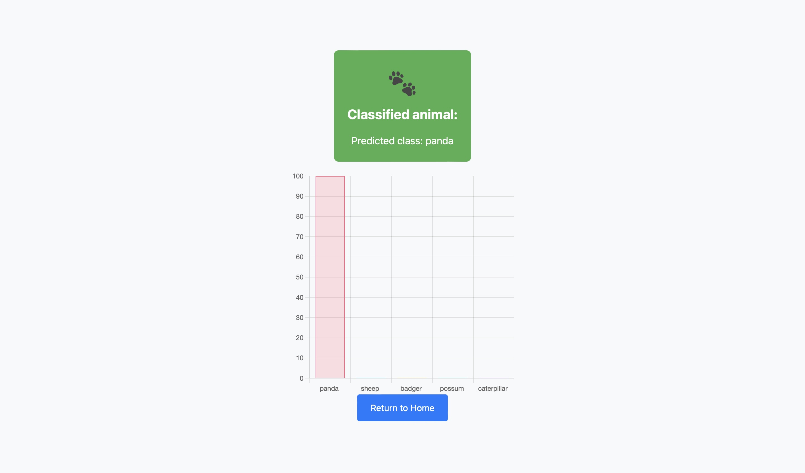

# Animal Classifier Web Application


## Overview

This web application allows users to upload an image of an animal and get it classified into one of several classes from a broader set of categories. The classification model is trained on a diverse dataset of animal images, covering various species and breeds.

## Prerequisites

Before running the application, you need to have the following installed:

- Python 3.x
- Django web framework
- TensorFlow library
- Chart.js library
- Keras library

## Installation

1. Clone this repository to your local machine.
2. Install the required Python packages using the following command:

   ```
   pip install -r requirements.txt
   ```

## Usage

1. Navigate to the project directory in the terminal.
2. Start the Django development server using the following command:

   ```
   python manage.py runserver
   ```

3. Open your web browser and go to `http://localhost:8000/` to access the home page.

## Instructions

### Step 1: Home Page



- On the home page, you will find instructions on how to use the application.
- Click the "Choose an image" button to select an image of an animal from your local device.

### Step 2: Select an Animal Photograph



- In this step, you will need to choose an appropriate photograph that clearly shows the animal you want to classify.
- Browse through your local files and select the most suitable image.

### Step 3: Classification Result



- After the image is classified, you will be redirected to the result page, which displays the predicted class for the uploaded animal image.
- Additionally, a bar chart will be shown, indicating the probabilities of the top classes the model considered.

### Step 4: Return to Home Page

- To classify another image, click the "Return to Home" button at the bottom of the result page. This will take you back to the home page, and you can repeat the process.

## Credits

- The animal classification model used in this application was trained using the TensorFlow library.
- The animal images dataset was obtained from [source](https://www.kaggle.com/datasets/iamsouravbanerjee/animal-image-dataset-90-different-animals?resource=download).

Please note that the dataset used for training the model is not included in this repository due to privacy and space-saving reasons. However, you can download the dataset from the link above if you need it for training or further analysis.

